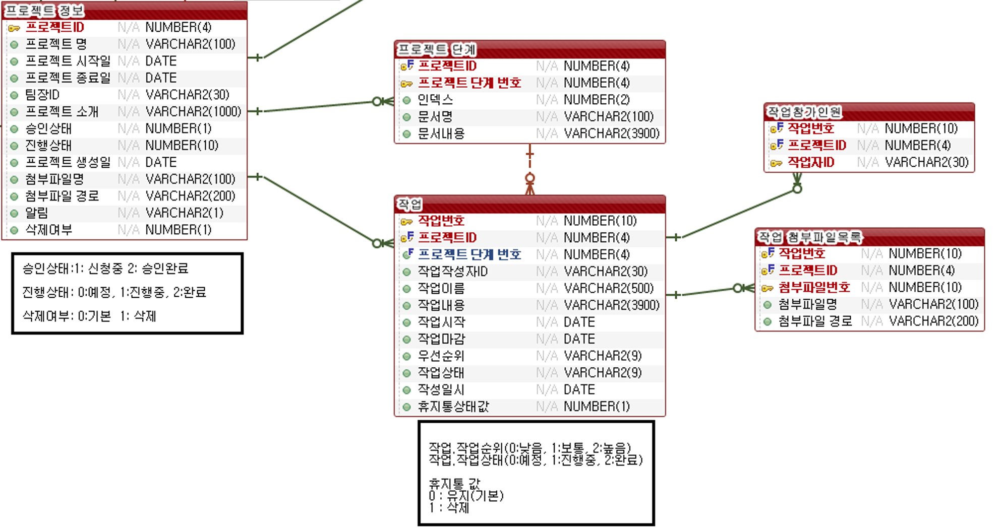
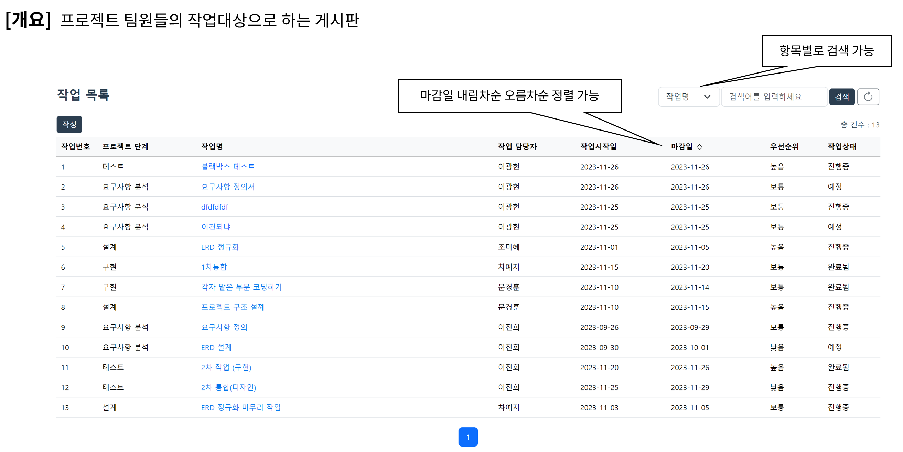
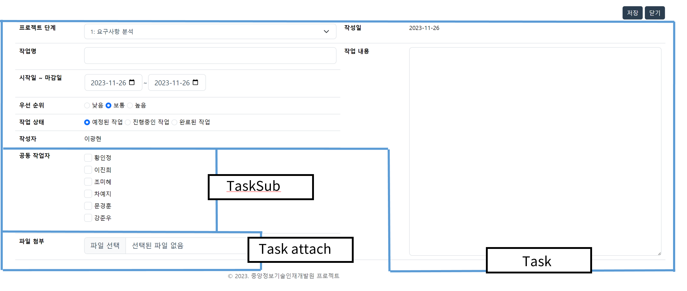
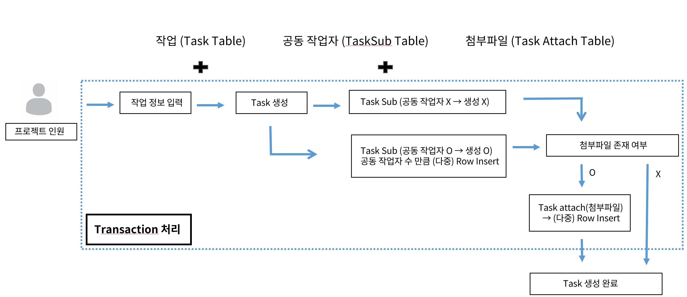
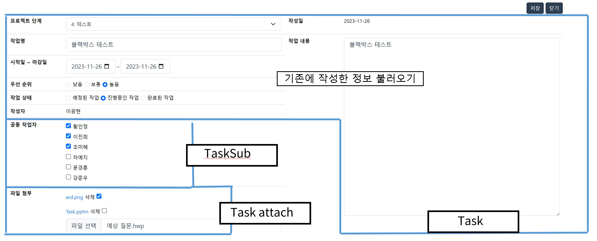
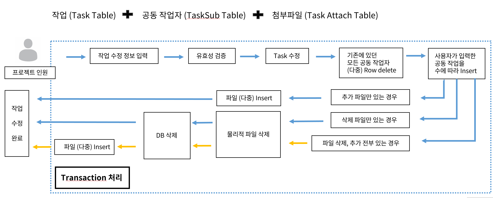
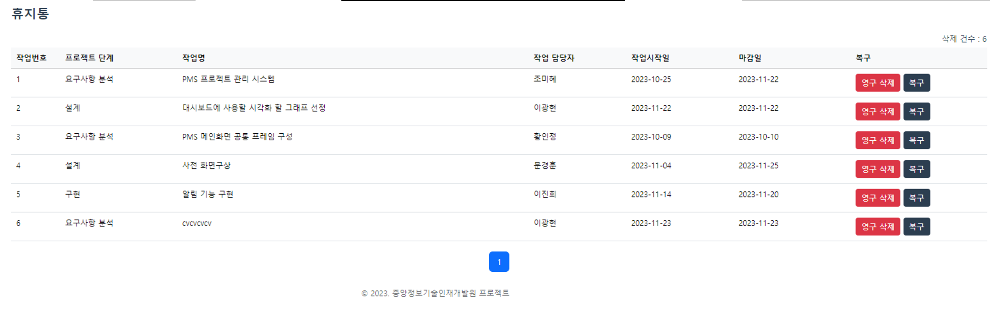
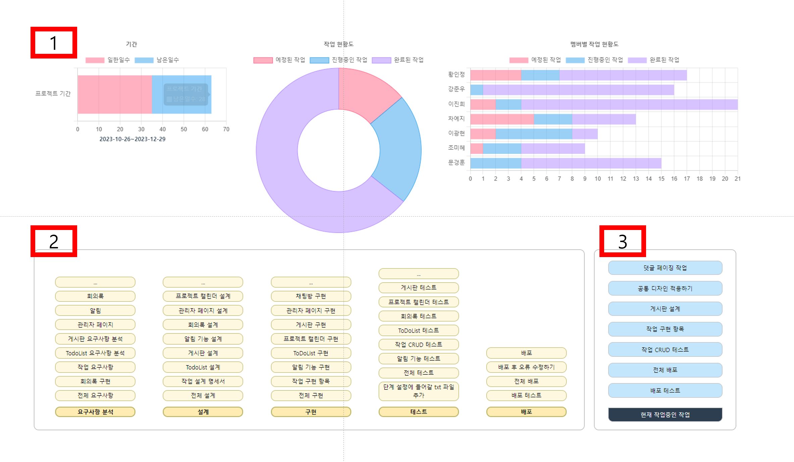
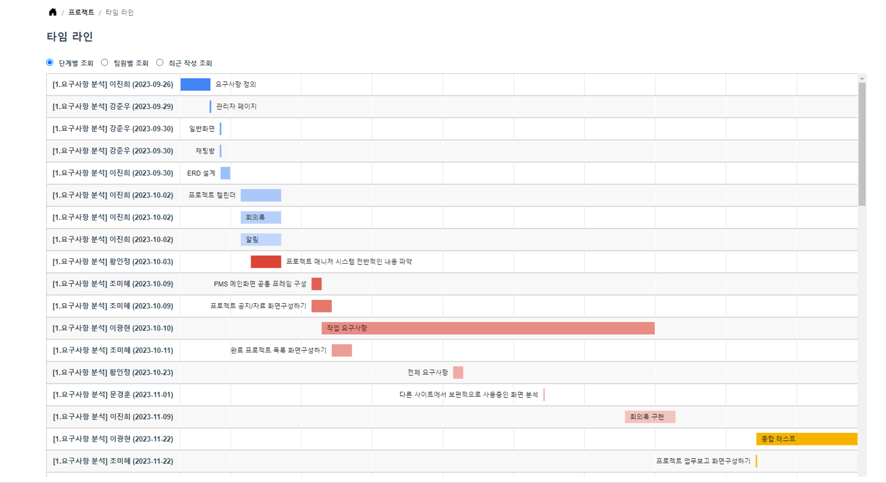

## 📣 중앙인재개발원 1차 프로젝트 - PMS(Project Manager System)

# 📖 프로젝트 개요
##  프로젝트 소개 

### 시스템 프로세스

###  프로젝트 기간
 🕛2023.10.10 - 2023.11.30

### 📚 개발환경

- 
- 
- 
-   
- 

## 프로젝트 팀원 및 역할
👑👩 팀장 황인정 (HIJ) : 프로젝트 생성, 프로젝트 관리, 관리자 페이지, 통합검색

🧑 팀원 이광현 (LKH) : 프로젝트 작업 문서 관리(생성/조회/수정/삭제) 및 다양한 시각화, 휴지통

👩 팀원 이진희 (LJH) : 프로젝트용 캘린더, 알림, 프로젝트 게시판

🧑 팀원 강준우 (KJO) : 채팅, 관리자 페이지

🧑 팀원 문경훈 (MKH) : 회원가입 및 권한 설정

👩 팀원 차예지 (CYJ) : 전체 공지사항/이벤트/Q&A 게시판, 검색기능, To Do List 등록/삭제

👩 팀원 조미혜 (JMH) : 프로젝트 메인, 프로젝트 Home, 프로젝트 게시판, 검색기능

## ERD 

## 🔭 나의 구현 기능

###  ❗ 나의 기능요약정리

#### 내가 관여하는 Table들

<ul>
  <li> 팀장이 프로젝트 생성을 신청하면 관리자가 승인하여 프로젝트가 생성됩니다.</li>
  <li> 프로젝트 내에서는 각 작업 단계(ex: 분석/설계, 기능 구현, 테스트, 배포)별로 작업을 생성하고 관리하며, 이를 수정, 삭제, 조회할 수 있습니다.</li>
  <li> 하나의 작업에는 여러 공동 작업자가 참여할 수 있고, 여러 개의 파일을 첨부할 수 있습니다.</li>
  <li> 이러한 작업들을 기반으로 다양한 그래프로 시각화하여 한눈에 보여줍니다.</li>
</ul>

---
### 🔥 작업목록 🔥  
 
    <!-- 작업목록 검색기능 -->
    <select id="task_list" parameterType="Task" resultType="Task">
        SELECT *
            FROM (
                SELECT rownum rn, a.*
                    FROM (
                        SELECT t.*, p.project_s_name, u.user_name
                            FROM task t
                                INNER JOIN prj_step p ON t.project_id = p.project_id AND t.project_step_seq = p.project_step_seq
                                INNER JOIN user_info u ON t.user_id = u.user_id
                                WHERE t.project_id = #{project_id} AND t.garbage = 0 and
                                <choose>
                                    <when test="keyword_division == 'task_subject'">
                                        t.task_subject like '%' || #{keyword} || '%'
                                    </when>
                                    <when test="keyword_division == 'project_s_name'">
                                        p.project_s_name like '%' || #{keyword} || '%'
                                    </when>
                                    <when test="keyword_division == 'user_name'">
                                        u.user_name like '%' || #{keyword} || '%'
                                    </when>
                                    <otherwise>
                                        1=1
                                    </otherwise>
                                </choose>
                                order by t.create_date desc
                                ) a
        ) 
        WHERE rn BETWEEN #{start} AND #{end}
    </select>
     

---
### 🔥 작업조회 🔥  

---
### 🔥 작업생성 🔥  
❗ 팀 프로젝트 팀원들의 작업 생성 요구 조건

작업(Task Table)을 생성할 때 여러 공동 작업자(TaskSub Table) 및 다수의 첨부 파일(Task Attach)이 생성될 수 있습니다.  
***다중 Row를 여러 테이블에 삽입하는 상황이 발생할 수 있습니다. ➡ 이러한 경우, 여러 개의 DAO를 묶어 하나의 서비스에서 트랜잭션을 처리하도록 구현합니다.***

---
 ###  🔥 작업 생성 프로세스  🔥

작업 생성 시 3개의 테이블이 모두 project_id와 task_id를 주요 키(PK)로 사용합니다.

➡ project_id는 기존 값에서 가져와 사용되어 문제가 없습니다.

**task_id(PK)** 는 Task Table에서 **MAX+1** 형식으로 생성됩니다. ➡ 이 값을 가져와 나머지 2개의 테이블(TaskSub, TaskAttach)에 삽입합니다.

Task(Table)에 Insert할 때는 **max+1** 을 하고, 그 이후 두 개의 테이블(TaskSub, TaskAttach)은 Task가 커밋된 후 그 시점에 **max 값** 을 가져와 같은 값을 사용합니다.

**Task_sub(Table)** 는 체크박스 형식으로 user_id를 리스트로 입력받아 List<taskSub> 형식으로 받아서 순서대로 **Insert** 합니다.

**task_attach(Table)** 인 첨부파일은 **PK가 (project_id, task_id, attach_no)** 로 3개입니다. 단순히 insert문을 3번 처리할 수도 있지만, 다른 방법으로 파일이 3개 들어온다고 가정했을 때, 현재의 **max 값** 에서 순서대로 **max+1, max+2, max+3** 과 같이 1씩 증가시키는 Java for문으로 **PK를 설정** 하고 다중 insert를 처리할 수 있습니다.

---
### 🔥 작업수정 🔥  
❗ 팀 프로젝트 팀원들의 작업 수정 요구 조건
>  결국 3개의 테이블(Task, TaskSub, TaskAttach)에 DML작업을 하는 것은 비슷하지만 약간의 차이가 있습니다.

---
 ###  🔥 작업 수정 프로세스  🔥
1. **수정 버튼 클릭**: 먼저 수정 버튼을 누르면 기존 정보가 표시되며, 여기에서 수정을 진행합니다.

2. **유효성 검증**: 수정 작업 진행 전에 유효성을 검증하고, 성공하면 수정이 이루어집니다.

3. **주의 사항**:
    - **Task Table**: 별 문제 없음.
    - **TaskSub 및 TaskAttach Table**: 추가 또는 삭제 가능. Update가 아닌 Insert와 Delete 경우에 해당됩니다.

    ➡ 따라서 해당 작업에 대한 공동작업자들을 모두 Delete 처리한 후, 입력된 값을 기반으로 다시 Insert합니다. 파일도 체크박스에 선택된 파일들을 먼저 삭제한 후에 다시 Insert합니다.

    (성능 측면에서는 Delete 처리 후에 Insert 처리를 하는 것이 데이터 낭비를 줄일 수 있습니다.)

   결국, 3개의 테이블에 대해 다중 Row를 Update, Insert, Delete 하는 경우이므로 생성과 마찬가지로 트랜잭션 처리를 수행합니다.

---
### 🔥 작업삭제 및 휴지통  🔥  
먼저 작업 상세 내역에 삭제 버튼을 누르면 휴지통으로 이동합니다.  
이는 데이터베이스 상에서 0과1의 상태값이  있는데 휴지통으로 이동하면서 0에서1로 변합니다.   
복구를 누를시에는 1에서 0으로 변하면서 다시 작업목록에 보여집니다.

휴지통에서 영구삭제를 누를시에 Delete 처리가 되는 프로세스입니다.

---
### 🔥 작업보드(대시보드) 🔥  
> 1. 3개의 그래프는 chart.js라는 API를 활용하였습니다.  
>>> 프로젝트 기간 그래프는 Project의 시작일과 마감일을 가져와 시간연산을 하여 막대그래프로 나타냈습니다.  
>>> 작업현활도는  Task상태의 합계를 가져와 도넛 차트로 나타냈습니다.  

>>> 멤버별 작업 현황도는 프로젝트의 각 인원별/작업 상태별로 데이터를 가공 후 누적막대그래프로 나타냈습니다.
>>><pre>
        <!-- 진척률 그래프 -->
      <select id="workload_chart" parameterType="java.lang.Integer" resultType="Task">
        <![CDATA[
            SELECT U.USER_NAME,
                  SUM(CASE WHEN T.TASK_STATUS = 0 THEN 1 ELSE 0 END) AS STATUS_0_COUNT,
                  SUM(CASE WHEN T.TASK_STATUS = 1 THEN 1 ELSE 0 END) AS STATUS_1_COUNT,
                  SUM(CASE WHEN T.TASK_STATUS = 2 THEN 1 ELSE 0 END) AS STATUS_2_COUNT
            FROM
                TASK T, USER_INFO U
            WHERE
                T.PROJECT_ID = #{project_id} AND T.USER_ID = U.USER_ID
            GROUP BY U.USER_NAME
            ]]>
      </select>
  </pre>   

> 2번과 3번은 마땅한 그래프가 없어 Javascript로 만들어서 보여주었습니다.
>> 2. 프로젝트 단계별로 최신순으로 어떤 작업들이 있는지 보여줍니다.  
>> 핵심 프로세스 
  >>> 프로젝트 단계를 key로 하는 map을 생성후  
  >>> 작업들을 순회하면서 작업의 프로젝트 단계와 key가 맞으면 value(List)에 넣습니다.
  >>> 최종적으로 프로젝트 단계를 Key로 갖고 value에는 단계에 해당하는 작업들이 List에 저장됩니다.
  <pre>
        -코드 중 일부-
        stepNameList.stream().forEach(m->mapData.put(m, new ArrayList<>()));
                // map의 키를 순회(프로젝트 단계이름)하면서 작업들도 같이 순회 ->
                // 작업의 단계이름과 키의 단계이름이 같으면 해당 키의 값에 잇는 리스트에 추가함
                for (String key : mapData.keySet()) {
                    for (Task t : stepTaskList) {
                        if (t.getProject_s_name().equals(key)) {
                            // 해당하는 키에 맞는 값 목록 가져오기
                            List<String> values = mapData.get(key);
                            if (values != null) {
                                // 값을 List<String>에 추가
                                values.add(t.getTask_subject());
                            }
                        }
                    }
                }
  </pre>
>> 3.  현재 진행중인 작업이 보여집니다. 클릭하면 해당 작업 상세보기로 이동합니다.

---
### 🔥 타임라인 🔥  
팀원들의 작업의 시작일과 종료일을 타임라인 형태로 시각화하여 보여줍니다.  
Google Chart  API를 사용했습니다.

버튼을 활용하여 프로젝트 단계별, 팁원별, 최근 작성별로 페이지 이동없이 보여집니다.

---
## 📌 프로젝트 회고 

  
  

