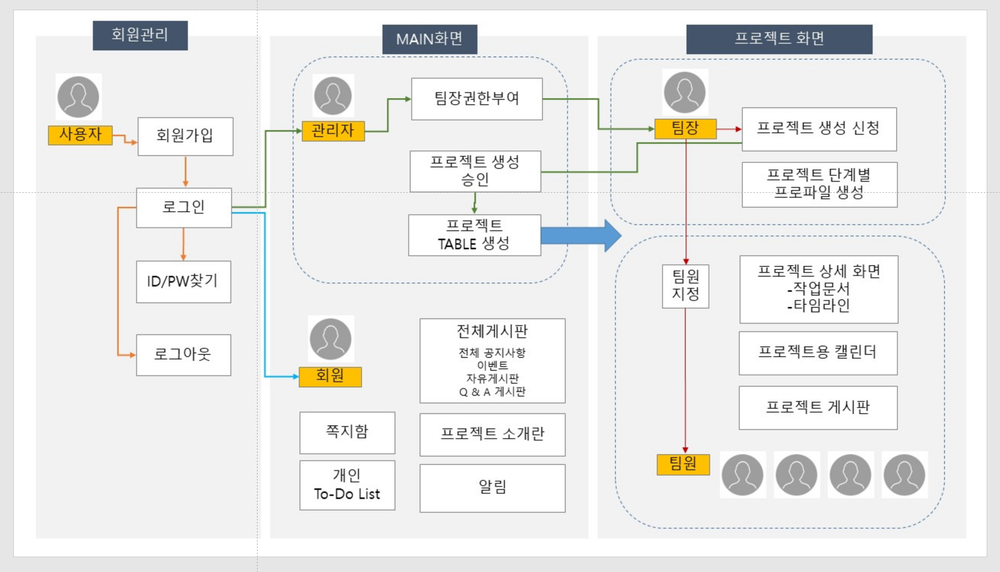
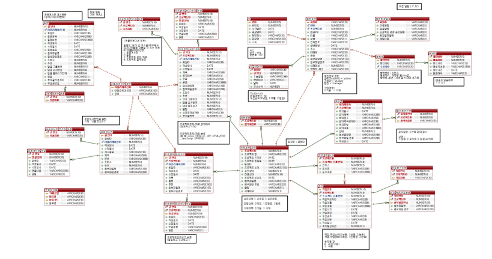

## 📣 중앙인재개발원 1차 프로젝트 - PMS(Project Manager System)

# 📖 프로젝트 개요
##  프로젝트 소개 

### 시스템 프로세스

###  프로젝트 기간
 🕛2023.10.10 - 2023.11.30

### 📚 개발환경

- 
- 
- 
-   
- 

## 프로젝트 팀원 및 역할
👑👩 팀장 황인정 (HIJ) : 프로젝트 생성, 프로젝트 관리, 관리자 페이지, 통합검색

🧑 팀원 이광현 (LKH) : 프로젝트 작업 문서 관리(생성/조회/수정/삭제) 및 다양한 시각화, 휴지통

👩 팀원 이진희 (LJH) : 프로젝트용 캘린더, 알림, 프로젝트 게시판

🧑 팀원 강준우 (KJO) : 채팅, 관리자 페이지

🧑 팀원 문경훈 (MKH) : 회원가입 및 권한 설정

👩 팀원 차예지 (CYJ) : 전체 공지사항/이벤트/Q&A 게시판, 검색기능, To Do List 등록/삭제

👩 팀원 조미혜 (JMH) : 프로젝트 메인, 프로젝트 Home, 프로젝트 게시판, 검색기능

## ERD 

## 🔭 나의 구현 기능

❗ 
<ul>
  <li>팀장이 생성신청시 관리자가 승인하면 프로젝트가 만들어진다.</li>
  <li>그 안에서 프로젝트 단계별[ex) 분석/설계, 기능구현,테스트, 배포]등 작업 생성해 관리(수정,삭제,조회)</li>
  <li>하나의 작업에는 여러 공동작업자가 았을 수 있고 여러개의 파일을 첨부 할 수 있다.</li>
  <li> 이러한 작업들을 바탕으로 여러 그래프로 시각화로 한눈에 보여준다.
</ul>

🔥 
  

## 📌 프로젝트 회고 

  
  

